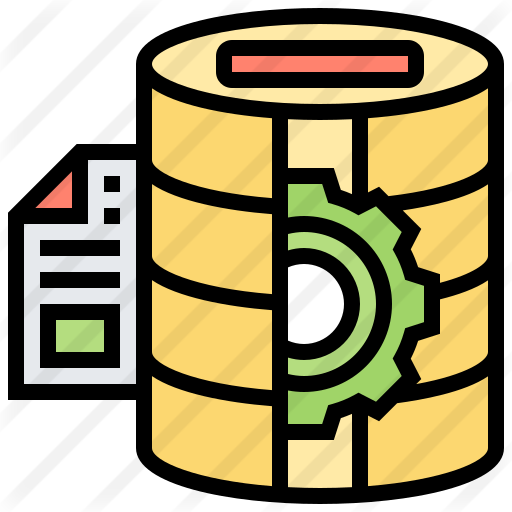

# Database 🛢️

> Handle your application database with factories, seeders and query builder in Node.js

[](https://github.com/jlenon7?tab=followers)
[](https://github.com/secjs/database/stargazers/)

<p>
    <a href="https://www.buymeacoffee.com/secjs" target="_blank"></a>
</p>

<p>
  

  

  

  
</p>

The intention behind this repository is to always maintain a `Database` class to manipulate data using any database
driver (SQL and NoSQL).



## Installation

> To use the high potential from this package you need to install first this other packages from SecJS,
> it keeps as dev dependency because one day `@secjs/core` will install everything once.

```bash
npm install @secjs/env @secjs/utils @secjs/config @secjs/contracts @secjs/exceptions
```

> Then you can install the package using:

```bash
npm install @secjs/database
```

## Usage

### Config database template

> First you need to create the configuration file database in the config folder on project root path. Is extremely important to use export default in these configurations.

```ts
import { Env } from '@secjs/env'
import { Path } from '@secjs/utils'

export default {
  /*
  |--------------------------------------------------------------------------
  | Default Database Connection Name
  |--------------------------------------------------------------------------
  |
  | Here you may specify which of the database connections below you wish
  | to use as your default connection for all database work. Of course
  | you may use many connections at once using the Database library.
  |
  */
  default: Env('DB_CONNECTION', 'postgres'),

  /*
  |--------------------------------------------------------------------------
  | Database Connections
  |--------------------------------------------------------------------------
  |
  | Here are each of the database connections setup for your application.
  | Of course, examples of configuring each database platform that is
  | supported by SecJS is shown below to make development simple.
  |
  */

  connections: {
    sqlite: {
      driver: 'sqlite',
      filename: Env('DB_FILENAME', Path.database('sqlite')),
    },

    mysql: {
      driver: 'mysql',
      url: Env('DB_URL', ''),
      host: Env('DB_HOST', '127.0.0.1'),
      port: Env({ type: 'number', name: 'DB_PORT' }, 3306),
      database: Env('DB_DATABASE', 'mysql'),
      user: Env('DB_USERNAME', 'root'),
      password: Env('DB_PASSWORD', ''),
    },

    postgres: {
      driver: 'postgres',
      url: Env('DB_URL', ''),
      host: Env('DB_HOST', '127.0.0.1'),
      port: Env({ type: 'number', name: 'DB_PORT' }, 5432),
      database: Env('DB_DATABASE', 'postgres'),
      user: Env('DB_USERNAME', 'root'),
      password: Env('DB_PASSWORD', ''),
    },

    sqlserver: {
      driver: 'sqlserver',
      url: Env('DB_URL', ''),
      host: Env('DB_HOST', '127.0.0.1'),
      port: Env({ type: 'number', name: 'DB_PORT' }, 1433),
      database: Env('DB_DATABASE', 'sqlserver'),
      user: Env('DB_USERNAME', 'root'),
      password: Env('DB_PASSWORD', ''),
    },

    mongo: {
      driver: 'mongo',
      protocol: 'mongodb',
      url: Env('DB_URL', ''),
      host: Env('DB_HOST', '127.0.0.1'),
      port: Env({ type: 'number', name: 'DB_PORT' }, 27017),
      database: Env('DB_DATABASE', 'mongodb'),
      user: Env('DB_USERNAME', ''),
      password: Env('DB_PASSWORD', ''),
      options: {
        w: 'majority',
        replicaSet: 'rs',
        retryWrites: true,
        authSource: 'admin',
        useNewUrlParser: true,
        useUnifiedTopology: true,
      },
    },
  },

  /*
  |--------------------------------------------------------------------------
  | Migration Repository Table
  |--------------------------------------------------------------------------
  |
  | This table keeps track of all the migrations that have already run for
  | your application. Using this information, we can determine which of
  | the migrations on disk haven't actually been run in the database.
  |
  */

  migrations: 'migrations',
}
```

### Database

> With the config/database file created you can use Database class to start handling operations in your database.

#### Create/drop tables and databases

```ts
import { Knex } from 'knex'
import { Database, TableBuilder } from '@secjs/database'

// Database class will always use the default value set in config/database 
// to handle operations, in this case, postgres.
const database = await new Database().connect()

// All SQL Drivers from Database are using Knex as query builder and for Mongo NoSQL, mongoose.
await database.createTable('products', (tableBuilder: Knex.TableBuilder) => {
  tableBuilder.increments('id').primary()
  tableBuilder.string('name').nullable()
  tableBuilder.integer('quantity').nullable().defaultTo(0)
})

// Creating the product details table
await database.createTable('product_details', (tableBuilder: Knex.TableBuilder) => {
  tableBuilder.increments('id').primary()
  tableBuilder.string('detail').nullable()
  // One product has many product details
  tableBuilder.integer('productId').references('id').inTable('products')
})

// Mongoose driver has a TableBuilder to create collections, 
// but it does not have all the methods from Knex table builder.

// Changing the connection to mongo database
await database.connection('mongo').connect()

// With mongo connection we do not have to specify the id because
// mongoose auto create the _id property
await database.createTable('products', (tableBuilder: TableBuilder) => {
  tableBuilder.string('name').nullable()
  tableBuilder.integer('quantity').nullable().defaultTo(0)
})

await database.createTable('product_details', (tableBuilder: TableBuilder) => {
  tableBuilder.string('detail').nullable()
  tableBuilder.integer('productId').references('id').inTable('products')
})

// Drop table products from database
await database.dropTable('products')

// You can also create databases
await database.createDatabase('testing-database')

// Then you can create a new database instance to connect to this new database
const runtimeConfigurations = { database: 'testing-database' }

const testingDatabase = await new Database(runtimeConfigurations).connection('mongo').connect()

// Or a more simple way using the same instance, is just calling the connection method again but with runtimeConfigs
await database.connection('mongo', runtimeConfigurations).connect()

// You can drop databases too
await database.dropDatabase('testing-database')
```

#### Insert products

```ts
// Insert and return an array of ID
const productIds = await database
  .buildTable('products')
  .insert([{ name: 'iPhone 10' }, { name: 'iPhone 11' }, { name: 'iPhone 12' }])

// Insert and return an array of products objects
const products = await database
  .buildTable('products')
  .insertAndGet({ name: 'iPhone 13' })

// WARN - buildTable method needs to be called only one time before the connection is stabilished.
// when you call buildTable it saves in the Driver instance the table that you are working on.

// So, all the operations that I call now will use 'products' table to operate. Example:
const data = await database
  // .buildTable('products') I do not need this anymore
  .findMany() // Will find all the data inside products table
```

#### Get products

```ts
// Build a where query and handle it with find, find return only one value
// If using mongodb change from id to _id
const product = await database.buildWhere('id', idIphone).find()

// Find many return an array of values
const products = await database.findMany()

const page = 0
const limit = 10

// Find many products paginated and return meta and links
const { data, meta, links } = await database.paginate(page, limit, '/products')

// Find many products paginated and return only the data
const productsPaginated = await database.forPage(page, limit)
```

#### Update products

```ts
const productIds = await database.insert([{ name: 'iPhone 10' }, { name: 'iPhone 11' }])

// Be carefull with update, remember to always use where
const productsUpdated = await database
  .buildWhereIn('id', productIds)
  .updateAndGet({ name: 'iPhone X' }) // or updateAngGet('name', 'iPhone X')

console.log(productsUpdated) // [{ id: 1, name: 'iPhone X', quantity: 0 }, { id: 2, name: 'iPhone X', quantity: 0 }]
```

#### Delete products

```ts
const productIds = await database.insert([{ name: 'iPhone 10' }, { name: 'iPhone 11' }])

// Be carefull with delete, remember to always use where
await database
  .buildWhereIn('id', productIds)
  .delete()
```

#### Join relations

```ts
const productIds = await database.insert([{ name: 'iPhone 10' }, { name: 'iPhone 11' }])

// Creating a new detail for each product created
const promisesPending = productIds.map(productId => (database.buildTable('product_details').insert({
  detail: '64 GB',
  productId
})))

// Resolving the array of promises
await Promise.all(promisesPending)

const productsWithDetails = await database
  .buildTable('products')
  .buildJoin('product_details', 'products.id', 'product_details.id', 'leftJoin')
  .findMany()

// If using SQL driver, the detail will come inside the main product object.
//Knex does not map the relations, is just a query builder.
console.log(productsWithDetails) // [{ id: 1, name: 'iPhone 10', quantity: 0, detail: '64 GB', productId: 1 }, ...]

// But if using MongoDriver, mongoose will map the "relation" and bring product details inside an object
console.log(productsWithDetails) // [{ id: 1, name: 'iPhone 10', quantity: 0, product_details: [{ id: 1, detail: '64 GB', productId: 1 }] }, ...]
```

#### Clone Database Query Chain

```ts
// Set the table products
database.buildTable('products')

// Clone the database query chain, this will create a new instance of the Database class
// but with the exactly same query chain.
const clonedDatabase = await database.clone()

console.log(database === clonedDatabase) // false

// This insert will be done in products table because of database.buildTable
const arrayOfIds = await clonedDatabase.insert({ name: 'AirPods 2' })
```

#### Clone client instance (Knex, Mongoose, etc)

```ts
import { Knex } from 'knex'

// This method will give you an instance of the client 
// depending the driver that you are using
const { client } = await database.cloneQuery<Knex.QueryBuilder>()

const arrayOfIds = await client.insert({ name: 'AirPods 2' }, 'id')

{
  // For mongoose you can set the Schema as type
  await database.connection('mongo').connect()

  const { client, session } = await database.cloneQuery<UserSchema>()

  // If using session...
  const product = await client.insertOne({ name: 'AirPods 2' }, { session })
}
```

#### Database Transactions

```ts
// Start the transaction
const trx = await database.beginTransaction()

await trx
  .buildTable('products')
  .insert({ name: 'AirPods 3' })

try {
  // Do some process that could fail...

  // Commit the transaction if process does not fail
  await trx.commit()
} catch (error) {
  // Handle the error...

  // Rollback the transaction and all the operations done in the database
  await trx.rollback()
}
```

#### Pluck column values

```ts
await database
  .buildTable('products')
  .insert([{ name: 'Apple Watch Series 2' }, { name: 'Apple Watch Series 3' }])

// Pluck get the value of only one column
const productsName = await database.pluck('name')

console.log(productsName) // ['Apple Watch Series 2', 'Apple Watch Series 3']
```

#### Raw queries

```ts
await database
  .buildTable('products')
  .insert({ name: 'iPhone X' })

// Using Knex
const knexRaw = await database.raw('SELECT * FROM ??;', ['products'])

console.log(knexRaw) // { command: 'SELECT', rowCount: 1, rows: [{ id: 1, name: 'iPhone X' }] }

// Using Mongoose
await database.connection('mongo').connect()

const mongooseRaw = await database.raw('db.collection(??).find().toArray()', ['products'])

console.log(mongooseRaw)  // { command: 'find()', rowCount: 1, rows: [{ id: 1, name: 'iPhone X' }] }
```

...

---

## License

Made with 🖤 by [jlenon7](https://github.com/jlenon7) :wave:
